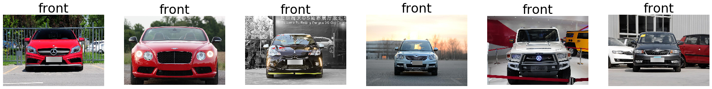
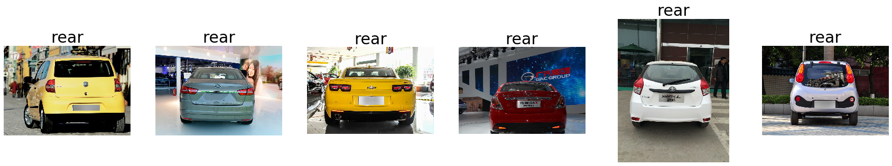
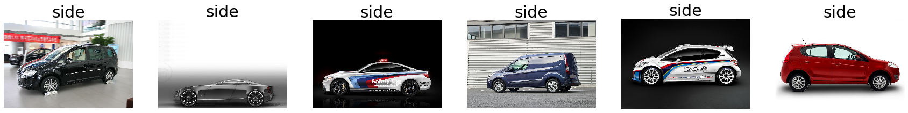
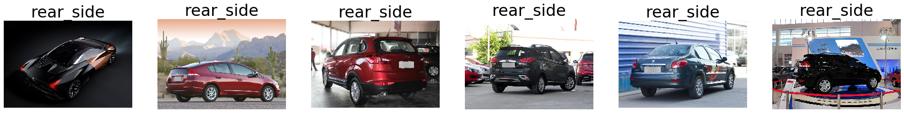
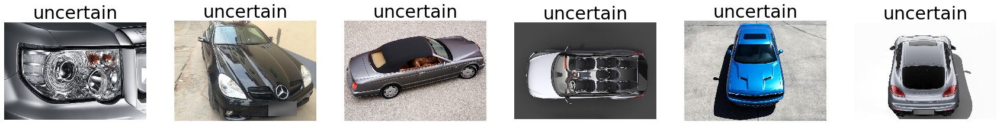

# Car Classification and Verification

Fine-grained car classification and recognition can be used for various purposes especially in modern transportation systems such as regulation, description and indexing. The overall goal of this project is to classify an image into one of the 163 car makers and 1716 car models.

## Dataset

The [CompCars datasets](http://mmlab.ie.cuhk.edu.hk/datasets/comp_cars/index.html) have two scenarios which are images from web-nature and surveillance-nature images. For this project, we will only use the web-nature data that captures the entire car which is 136726 images in total. The images can be classified into 163 car makes with 1716 car models.

The dataset includes 4 unique features which are car hierarchy, car attributes, viewpoints and car parts. Car hierarchy contains information of car makers and car models that are the results of classification to be achieved. The other feature used will be the viewpoints. We used the viewpoints to split the data to ensure an even distribution of the different viewpoints of the same car model in test, train, validation data.









## Getting Started

### Dataset Download
Please refer to the download guide: http://mmlab.ie.cuhk.edu.hk/datasets/comp_cars/instruction.txt

### Clone Repository
```
git clone https://github.com/weichee98/Car-Classification-and-Verification.git
```

### Requirements
- [numpy](https://numpy.org/install/)
- [scipy](https://www.scipy.org/install.html)
- [pandas](https://pandas.pydata.org/pandas-docs/stable/getting_started/install.html)
- [TensorFlow 2.2.0](https://www.tensorflow.org/install) or later
- [matplotlib](https://matplotlib.org/)
- [tqdm](https://github.com/tqdm/tqdm)
- [sklearn](https://scikit-learn.org/stable/)

## Directory Structure

The main directory in this project is [Car-Classification-and-Verification](https://github.com/weichee98/Car-Classification-and-Verification), which has the directory structure as below:
```
Car-Classification-and-Verification
├── data
│   └── image
|       └── 1
|           └── 1101
|               └── 2011
|                   └── 3a62131af5fe8e.jpg
|                   └── 07b90decb92ba6.jpg
|                   └── ...
|           └── 1102
|           └── ...
|       └── 2
|       └── ...
|   └── label
│   └── image
|       └── 1
|           └── 1101
|               └── 2011
|                   └── 3a62131af5fe8e.txt
|                   └── 07b90decb92ba6.txt
|                   └── ...
|           └── 1102
|           └── ...
|       └── 2
|       └── ...
│   └── misc
|       └── attributes.txt
|       └── car_type.mat
|       └── make_model_name.mat
|   └── train_test_split
|       └── classification
|           └── test.txt
|           └── train.txt
|       └── part
|           └── test_part_1.txt
|           └── test_part_2.txt
|           └── ...
|           └── train_part_1.txt
|           └── train_part_2.txt
|           └── ...
|       └── verification
|           └── verification_pairs_easy.txt
|           └── verification_pairs_hard.txt
|           └── verification_pairs_medium.txt
|           └── verification_train.txt
│   └── data.csv
|   └── result.csv
│   └── test.csv
│   └── train.csv
|   └── valid.csv
├── model
│   └── ...
│   └── googlenet
|       └── base
|           └── googlenet.h5
|           └── googlenet.json
|           └── googlenet.npy
|           └── googlenet.py
|       └── googlenet_make_classifier_20201001232148.data-00000-of-00002
|       └── googlenet_make_classifier_20201001232148.data-00001-of-00002
|       └── googlenet_make_classifier_20201001232148.index
|       └── googlenet_make_classifier_20201001232148.json
│   └── inception_v3_make_classifier
|       └── inception_v3_make_classifier_20201007001143.data-00000-of-00002
|       └── inception_v3_make_classifier_20201007001143.data-00001-of-00002
|       └── inception_v3_make_classifier_20201007001143.index
|       └── inception_v3_make_classifier_20201007001143.json
│   └── ...
│   └── model_manager.py
│   └── dot_make_description.json
│   └── make_classifier_description.json
│   └── model_classifier_description.json
│   └── triplet_make_description.json
├── src
│   └── dot_product.py
│   └── input_pipeline.py
│   └── prepare_dataset.py
│   └── train_test_split.py
│   └── triplet.py
├── utils
│   └── dict_json.py
│   └── logger.py
├── make_dot.py
├── make_test.py
├── make_train.py
├── make_triplet.py
└── model_test.py
└── model_train.py
```

| Directory                                                                                 | Description                                                                                                                                                                                                     |
|-------------------------------------------------------------------------------------------|-----------------------------------------------------------------------------------------------------------------------------------------------------------------------------------------------------------------|
| [data](https://github.com/weichee98/Car-Classification-and-Verification/tree/main/data)   | The directory contains the images for training and testing, and the required csv files. After downloading the dataset, make sure to copy the dataset to this folder following the required directory structure. |
| [image](https://github.com/weichee98/Car-Classification-and-Verification/tree/main/image) | The directory contains the analysis result images including graphs and plots.                                                                                                                                   |
| [log](https://github.com/weichee98/Car-Classification-and-Verification/tree/main/log)     | The directory contains the training and testing logs.                                                                                                                                                           |
| [model](https://github.com/weichee98/Car-Classification-and-Verification/tree/main/model) | The directory contains saved models and a python file model_manager.py, which an be used to save and load models.                                                                                               |
| [src](https://github.com/weichee98/Car-Classification-and-Verification/tree/main/src)     | The directory contains 5 python files, which are important for training and testing purposes.                                                                                                                   |
| [utils](https://github.com/weichee98/Car-Classification-and-Verification/tree/main/utils) | The directory contains 2 python files, used as utilities.                                                                                                                                                       |


## Python Files

#### 1. [model/googlenet/base/googlenet.py](https://github.com/weichee98/Car-Classification-and-Verification/blob/main/model/googlenet/base/googlenet.py)

This file contains LRN layer class and a function `Googlenet` that is used to create googlenet model for feature extraction.

#### 2. [model/model_manager.py](https://github.com/weichee98/Car-Classification-and-Verification/blob/main/model/model_manager.py)

| Function         | Description                          |
|------------------|--------------------------------------|
| `save_model`     | Save model                           |
| `load_model`     | Load model                           |
| `get_input_size` | Get input image size using model name|

#### 3. [src/dot_product.py](https://github.com/weichee98/Car-Classification-and-Verification/blob/main/src/dot_product.py)

This file contains a function `dot_product_cross_entropy_loss` to calculate the binary cross entropy using the dot product of 2 image embeddings.

#### 4. [src/input_pipeline.py](https://github.com/weichee98/Car-Classification-and-Verification/blob/main/src/input_pipeline.py)

This file contains a class `InputPipeline` that can be used to generate tensorflow dataset used for training, validation and testing.

#### 5. [src/prepare_dataset.py](https://github.com/weichee98/Car-Classification-and-Verification/blob/main/src/prepare_dataset.py)

This is the file that should be run to generate `data/data.csv`, which contains `image_name` of all images and their corresponding `maker_id`, `model_id`, `released_year`, `view_point` and `bounding_box` (`x1`, `x2`, `y1` and `y2`). To run the file:

```
$ cd Car-Classification-and-Verification/src
$ python prepare_dataset.py
```

#### 6. [src/train_test_split.py](https://github.com/weichee98/Car-Classification-and-Verification/blob/main/src/prepare_dataset.py)

This is the file that should be run to split the rows in `data/data.csv` to generate `data/train.csv`, `data/valid.csv` and `data/test.csv` according to the given `test_ratio` and `valid_ratio`. To run the file:

```
$ cd Car-Classification-and-Verification/src
$ python train_test_split.py
```

#### 7. [src/triplet.py](https://github.com/weichee98/Car-Classification-and-Verification/blob/main/src/triplet.py)

| Class or Function      | Description                                                                                                                                                                 |
|------------------------|-----------------------------------------------------------------------------------------------------------------------------------------------------------------------------|
| TripletInput           | Used to generate random triplets                                                                                                                                            |
| triplet_loss           | Loss function if TripletInput class is used for triplet generation. Takes the mean triplet loss across all generated triplets.                                              |
| triplet_loss_hard      | Loss function if TripletInput class is used for triplet generation. Takes the maximum triplet loss across all generated triplets.                                           |
| batch_all_triplet_loss | Loss function for online triplet mining across a batch of images. If `semihard` is True, performs semihard triplet mining. If `hard` is True, performs hard triplet mining. |

#### 8. [utils/dict_json.py](https://github.com/weichee98/Car-Classification-and-Verification/blob/main/utils/dict_json.py)

| Function            | Description                              |
|---------------------|------------------------------------------|
| `filter_dict`       | Return dictionary with only required keys|
| `write_dict_to_json`| Write dictionary to json file            |
| `read_json_to_dict` | Read json file into dictionary           |


#### 9. [utils/logger.py](https://github.com/weichee98/Car-Classification-and-Verification/blob/main/utils/logger.py)

This file contains a `Logger` class that can be used to log (print) training and testing results and timing.

#### 10. [make_dot.py](https://github.com/weichee98/Car-Classification-and-Verification/blob/main/make_dot.py)

Run this file to train models for image feature extraction (embeddings) using the dot product binary cross entropy loss.

To train a new model (redefine model inside `make_dot.py`):
```
$ python make_dot.py -d data/train.csv -v data/valid.csv -i data/image/ -lr 1e-3 -o SGD
```

To continue training from a model (change the `model_dir` and `model_name` accordingly):
```
$ model_dir='YOUR_MODEL_DIR'
$ model_name='YOUR_MODEL_NAME'
$ python make_dot.py -d data/train.csv -v data/valid.csv -i data/image/ \
    -mc model/$model_dir/$model_name.json -mw model/$model_dir/$model_name \
    -lr 1e-3 -o SGD
```

#### 11. [make_test.py](https://github.com/weichee98/Car-Classification-and-Verification/blob/main/make_test.py)

Run this file to test car maker classifier trained to predict car makers from images (change the `model_dir` and `model_name` accordingly). 

```
$ model_dir='YOUR_MODEL_DIR'
$ model_name='YOUR_MODEL_NAME'
$ python make_test.py -d data/test.csv -i data/image/ \
    -mc model/$model_dir/$model_name.json -mw model/$model_dir/$model_name
```

#### 12. [make_train.py](https://github.com/weichee98/Car-Classification-and-Verification/blob/main/make_train.py)

Run this file to train car maker classifier to predict car makers from images.

To train a new model (redefine model inside `make_train.py`):
```
$ python make_train.py -d data/train.csv -v data/valid.csv -i data/image/ -lr 0.01 -s True -o SGD
```

To continue training from a model (change the `model_dir` and `model_name` accordingly):
```
$ model_dir='YOUR_MODEL_DIR'
$ model_name='YOUR_MODEL_NAME'
$ python make_train.py -d data/train.csv -v data/valid.csv -i data/image/ \
    -mc model/$model_dir/$model_name.json -mw model/$model_dir/$model_name \
    -o SGD -s True
```

To continue training from a model and start from a self-defined learning rate:
```
$ model_dir='YOUR_MODEL_DIR'
$ model_name='YOUR_MODEL_NAME'
$ python make_train.py -d data/train.csv -v data/valid.csv -i data/image/ \
    -mc model/$model_dir/$model_name.json -mw model/$model_dir/$model_name \
    -o SGD -s True -clr 1e-5
```

#### 13. [make_triplet.py](https://github.com/weichee98/Car-Classification-and-Verification/blob/main/make_triplet.py)

Run this file to train models for image feature extraction (embeddings) using triplet loss.

To train a new model (redefine model inside `make_triplet.py`):
```
$ python make_triplet.py -d data/train.csv -v data/valid.csv -i data/image/ -lr 2e-5 -o ADAM -md SEMIHARD
```

To continue training from a model (change the `model_dir` and `model_name` accordingly):
```
$ model_dir='YOUR_MODEL_DIR'
$ model_name='YOUR_MODEL_NAME'
$ python make_triplet.py -d data/train.csv -v data/valid.csv -i data/image/ \
    -mc model/$model_dir/$model_name.json -mw model/$model_dir/$model_name \
    -lr 5e-6 -o ADAM -md HARD
```

#### 14. [model_test.py](https://github.com/weichee98/Car-Classification-and-Verification/blob/main/model_test.py)

Run this file to test car model classifier trained to predict car models from images.

```
$ model_dir='YOUR_MODEL_DIR'
$ model_name='YOUR_MODEL_NAME'
$ python model_test.py -d data/test.csv -i data/image/ \
    -mc model/$model_dir/$model_name.json -mw model/$model_dir/$model_name
```

#### 15. [model_train.py](https://github.com/weichee98/Car-Classification-and-Verification/blob/main/model_train.py)

Run this file to train car model classifier to predict car models from images.

To train a new model (redefine model inside `make_train.py`):
```
$ python model_train.py -d data/train.csv -v data/valid.csv -i data/image/ -lr 0.001 -s True -o SGD
```

To continue training from a model (change the `model_dir` and `model_name` accordingly):
```
$ model_dir='YOUR_MODEL_DIR'
$ model_name='YOUR_MODEL_NAME'
$ python model_train.py -d data/train.csv -v data/valid.csv -i data/image/ \
    -mc model/$model_dir/$model_name.json -mw model/$model_dir/$model_name \
    -o SGD -s True
```

To continue training from a model and start from a self-defined learning rate:
```
$ model_dir='YOUR_MODEL_DIR'
$ model_name='YOUR_MODEL_NAME'
$ python model_train.py -d data/train.csv -v data/valid.csv -i data/image/ \
    -mc model/$model_dir/$model_name.json -mw model/$model_dir/$model_name \
    -o SGD -s True -clr 1e-5
```

## Results

1. [Car Maker Classification](results/Car-Maker-Classification.md)

2. [Car Model Classification](results/Car-Model-Classification.md)

3. [Car Verification](results/Car-Verification.md)


