# Car Maker Classification

## Googlenet

Googlenet is a type of CNN network with 22 layers introduced in 2014. It allows the network to choose between multiple convolutional filter sizes in each block and have max-pooling layers in between. However, the model is losing trend because of improvement achieved in other CNN-based models.

## Inception V3

Inception V3 is an Inception model introduced in 2015 and developed based on previous Inception models. The main improvements include Label Smoothing, factorized 7 x 7 convolutions and auxiliary classifier etc.

## Improvements on Previous Models

### Googlenet to Classify More Car Maker Classes

The [previous work](https://arxiv.org/pdf/1506.08959.pdf) only exploits part of the datasets to classify cars into 75 makers. Here, we take the whole dataset to perform classification into 163 car makers. We use GoogLeNet with an output softmax layer of 163 classes.

|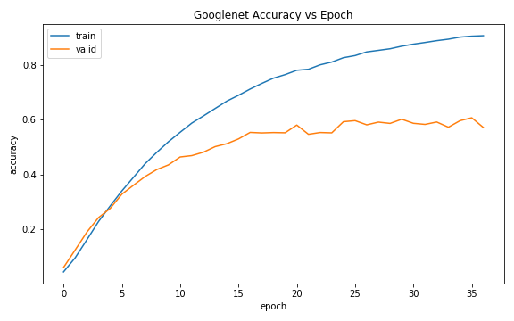|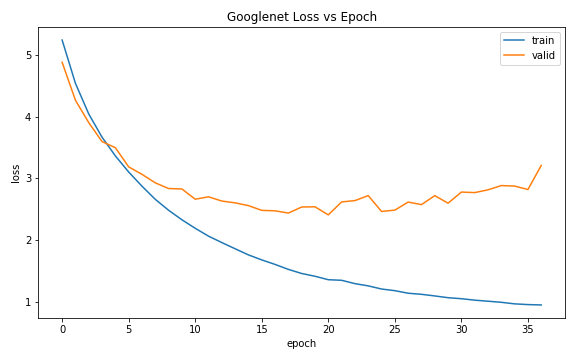|
|-|-|

The final accuracy obtained is 0.628 which is lower than the one published (0.829). This might be due to a greater number of classification classes.

### Inception V3 replacing Googlenet

Inception V3 has better performance in the computer vision field compared to GoogLeNet, here we replace Googlenet with Inception V3 and compare their performances on car maker classification.

| Model | Layers |
|-|-|
| Inception V3 (1) | <li>Layer 1: Inception V3 <li>Layer 2: Output Softmax Layer |
| Inception V3 (2) | <li>Layer 1: Inception V3 <li>Layer 2: Dropout (0.2 drop rate) <li>Layer 3: Output Softmax Layer |
| Inception V3 (3) | <li>Layer 1: Inception V3 <li>Layer 2: Dropout (0.2 drop rate) <li>Layer 3: 1000 Neurons Hidden Layer <li>Layer 4: Output Softmax Layer |
| Inception V3 (4) | <li>Layer 1: Inception V3 <li>Layer 2: Dropout (0.2 drop rate) <li>Layer 3: 1000 Neurons Hidden Layer <li>Layer 4: Dropout (0.2 drop rate) <li>Layer 5: 1000 Neurons Hidden Layer <li>Layer 6: Output Softmax Layer |

| Model | Accuracy | Loss |
|-|-|-|
| Inception V3 (1) | 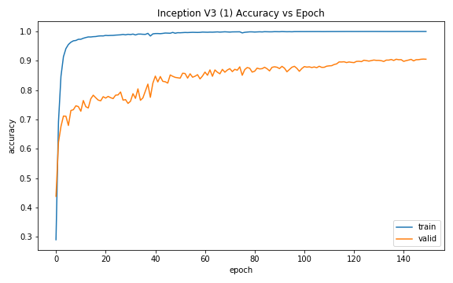 | 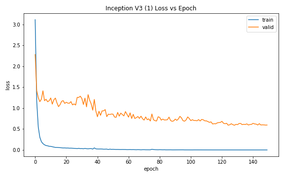 |
| Inception V3 (2) | 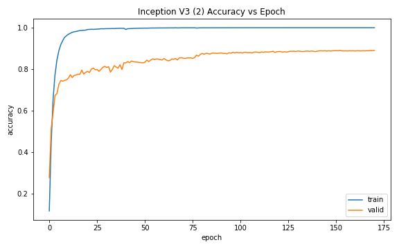 | 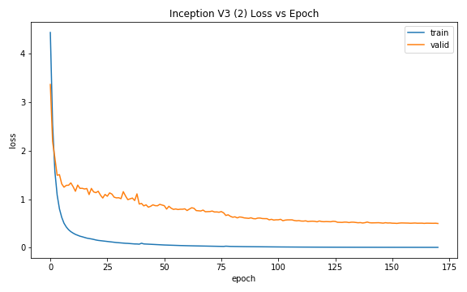 |
| Inception V3 (3) | 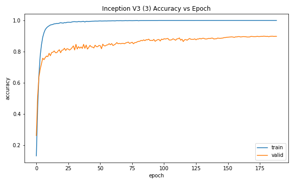 | 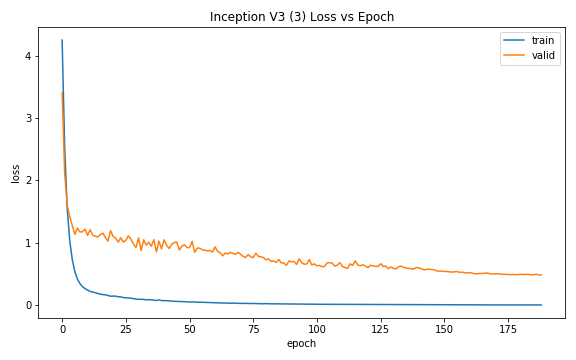 |
| Inception V3 (4) | 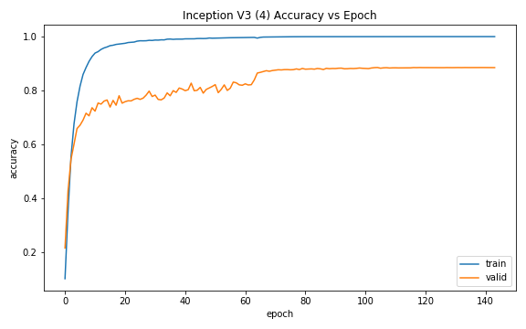 | 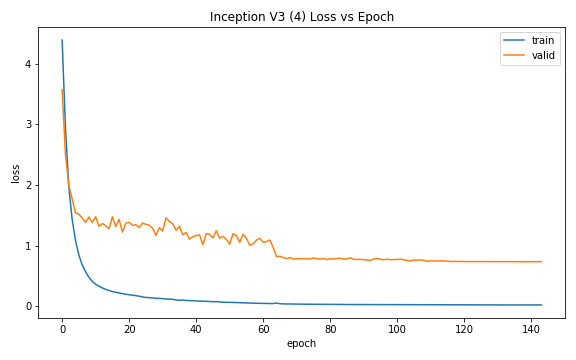 |

We can see that after replacing Googlenet with Inception V3, the classification model managed to improve drastically.

### Comparison

| 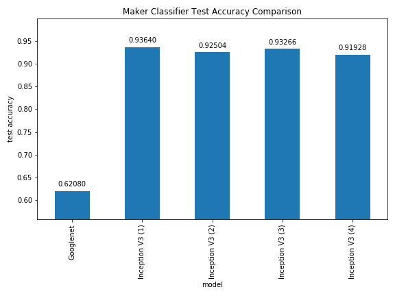 | 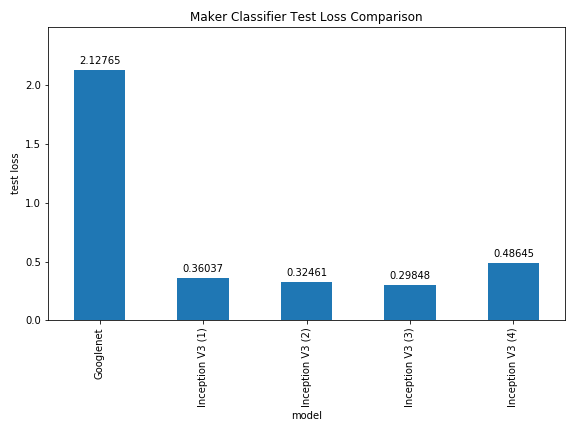 |
|-|-|

We can observe that Inception V3 performs significantly better than GoogLeNet  in terms of test accuracies and loss. Inception V3 is deeper (42 layers) and it has more parameters than GoogLeNet, more features can be learnt from the network, resulting in higher accuracy. 

| 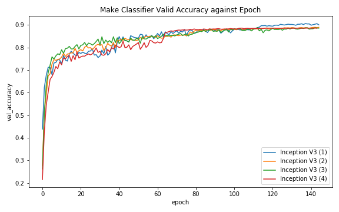 | 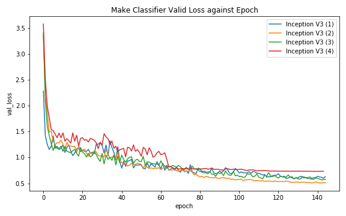 |
|-|-|

Comparing Inception V3 (1) with Inception V3 (2), the dropout layer does not help in improving test accuracy but it results in a lower test loss. Introducing a hidden layer of 1000 neurons in Inception V3 (3) improves the accuracy and lowers the loss as compared to Inception V3 (2). When 2 hidden layers of 1000 neurons are added in Inception V3 (4), the accuracies and losses become worse, which might be due to overfitting.

### Conclusion

As the model becomes deeper, the classification performance might be improved, but will also introduce more complexity to the model, results in overfitting. Therefore, regularizers and dropout layers can play significant role in helping the generalization of complex model, leading to better performance of deeper neural networks.

