# Car Model Classification

The original model in the [paper](https://arxiv.org/pdf/1506.08959.pdf) classifies only 431 car models out of 1716 car models. Here, we will use Inception V3 to extract features from images and fine tune the models’ hyperparameters to find the best model to classify all 1716 car models.

| Model | Layers | Optimizer |
|-|-|-|
| Model 1 | <li>Layer 1: Inception V3 <li>Layer 2: Dropout (0.2 drop rate) <li>Layer 3: Output Softmax Layer                                                                                                                                                            | Adam      |
| Model 2 | <li>Layer 1: Inception V3 <li>Layer 2: Dropout (0.2 drop rate) <li>Layer 3: 1000 Neurons Hidden Layer (L2 Regularization 0.001) <li>Layer 4: Output Softmax Layer                                                                                               | Adam      |
| Model 3 | <li>Layer 1: Inception V3 <li>Layer 2: Dropout (0.2 drop rate) <li>Layer 3: 2000 Neurons Hidden Layer (L2 Regularization 0.001) <li>Layer 4: Output Softmax Layer                                                                                               | Adam      |
| Model 4 | <li>Layer 1: Inception V3 <li>Layer 2: Dropout (0.2 drop rate) <li>Layer 3: Output Softmax Layer                                                                                                                                                            | RMSprop   |
| Model 5 | <li>Layer 1: Inception V3 <li>Layer 2: Dropout (0.2 drop rate) <li>Layer 3: 1000 Neurons Hidden Layer (L2 Regularization 0.001) <li>Layer 4: Output Softmax Layer                                                                                               | RMSprop   |
| Model 6 | <li>Layer 1: Inception V3 <li>Layer 2: Dropout (0.2 drop rate) <li>Layer 3: 2000 Neurons Hidden Layer (L2 Regularization 0.001) <li>Layer 4: Output Softmax Layer                                                                                               | RMSprop   |
| Model 7 | <li>Layer 1: Inception V3 <li>Layer 2: Dropout (0.2 drop rate) <li>Layer 3: 2000 Neurons Hidden Layer (No Regularization) <li>Layer 4: Output Softmax Layer                                                                                                     | Adam      |
| Model 8 | <li>Layer 1: Inception V3 <li>Layer 2: Dropout (0.2 drop rate) <li>Layer 3: 2000 Neurons Hidden Layer (L2 Regularization 0.001) <li>Layer 4: Dropout (0.2 drop rate) <li>Layer 5: 2000 Neurons Hidden Layer (L2 Regularization 0.001) <li>Layer 6: Output Softmax Layer | Adam      |
| Model 9 | <li>Layer 1: Inception V3 <li>Layer 2: Dropout (0.2 drop rate) <li>Layer 3: Output Softmax Layer                                                                                                                                                            | SGD       |

| Model | Accuracy | Loss |
|-|-|-|
| Model 1 | 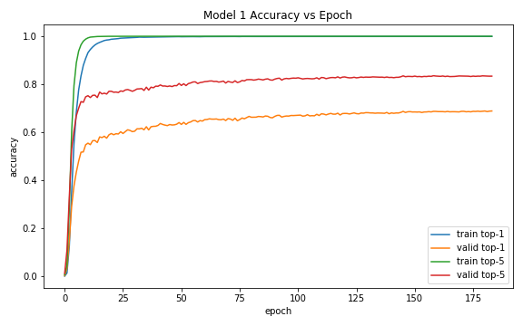 | 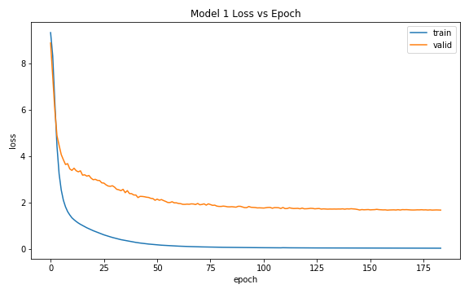 |
| Model 2 | 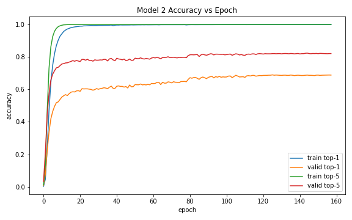 | 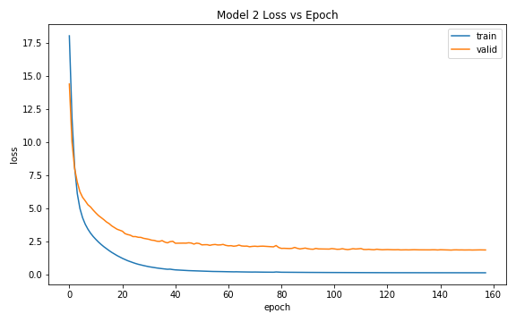 |
| Model 3 | 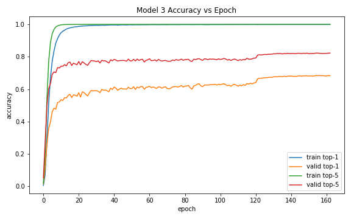 | 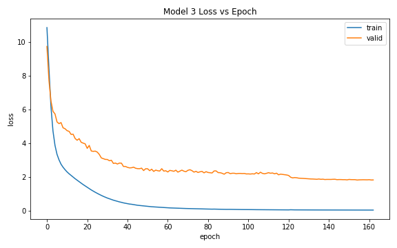 |
| Model 4 | 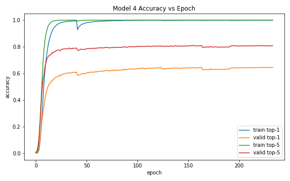 | 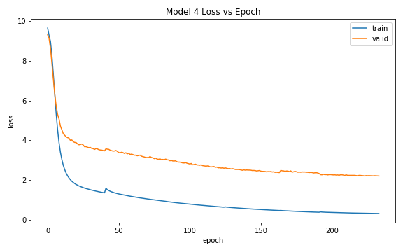 |
| Model 5 | 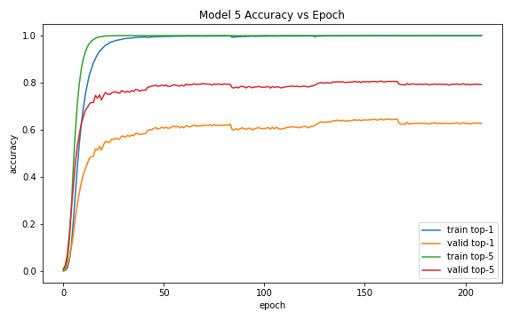 | 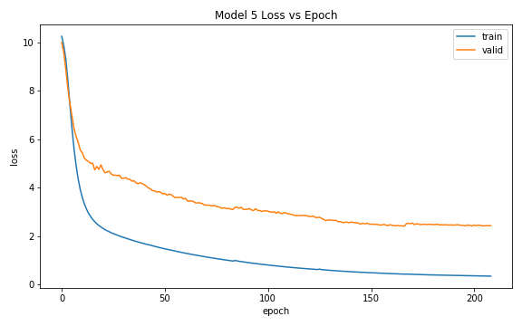 |
| Model 6 | 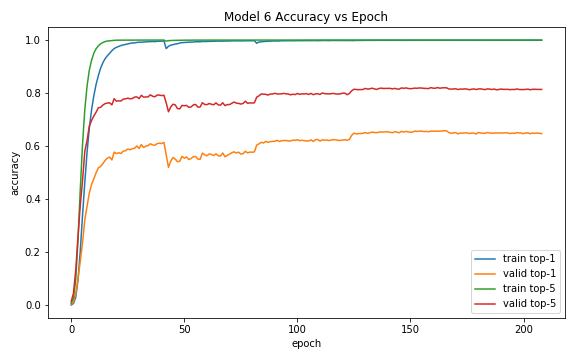 | 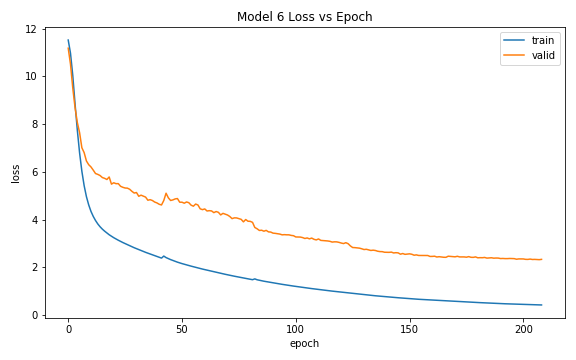 |
| Model 7 | 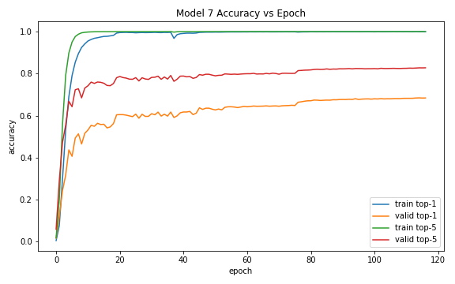 | 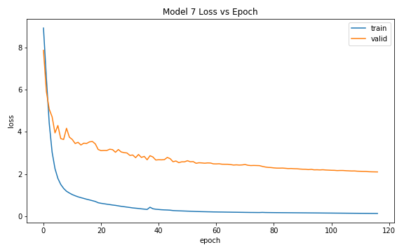 |
| Model 8 | 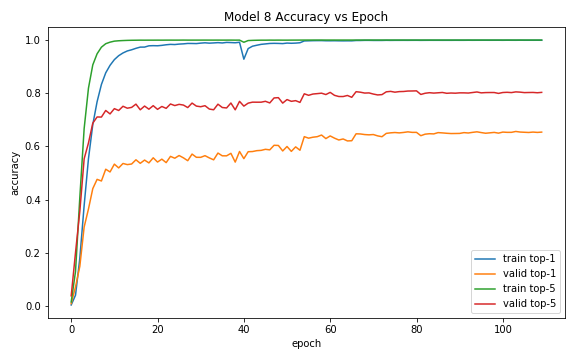 | 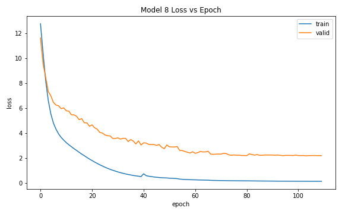 |
| Model 9 | 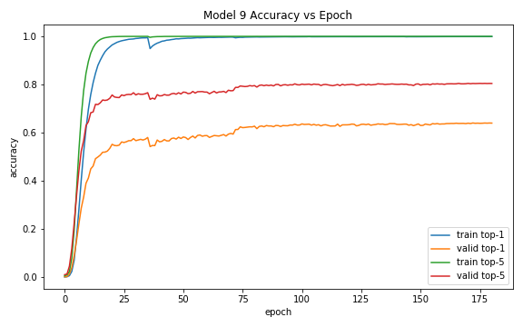 | 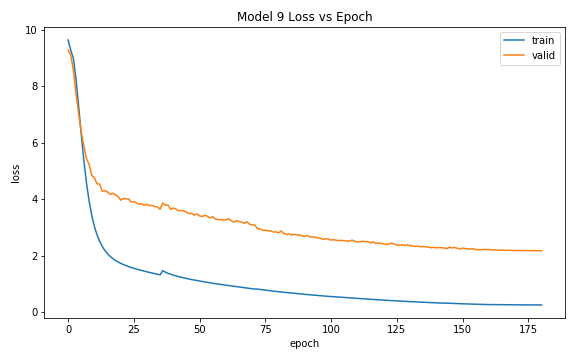 |

## Optimizer

We have tried out different optimizers, which are Adam, RMSProp and SGD with Momentum for the same model architecture (Model 1, Model 4 and Model 7). Among these optimizers, we can observe that Model 1 using Adam optimizer is the best among all as it yields the lowest validation loss and highest validation top-1 and top-5 accuracy.

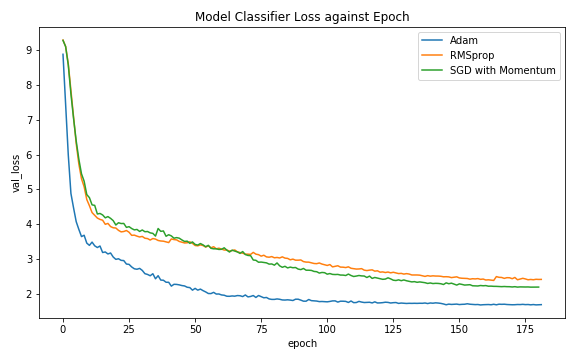
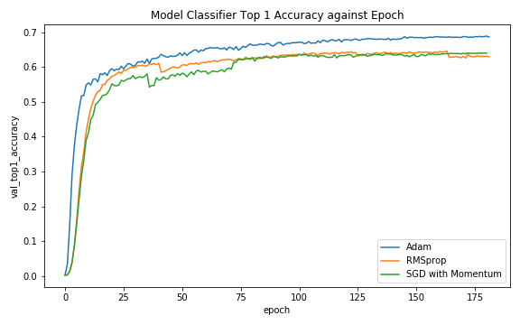
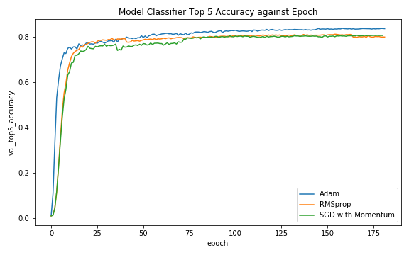

## Model Architecture

Different models (Model 1, Model 2, Model 3, Model 5 and Model 7) are trained using Adam optimizer and compared below. The base model (Model 1) manages to achieve the lowest validation loss, followed by Model 2 with an additional 1000 neuron hidden layer using L2 regularization with decay rate of 0.001. In terms of validation top-1 and top-5 accuracies, we can see that the Model 1, Model 4 and Model 7 achieves similar and the best results among all models.

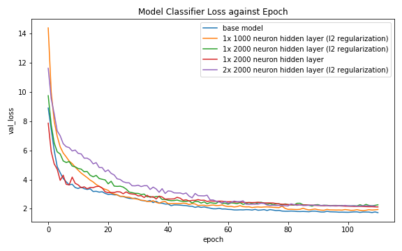
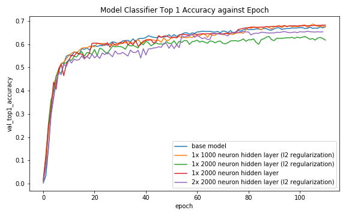
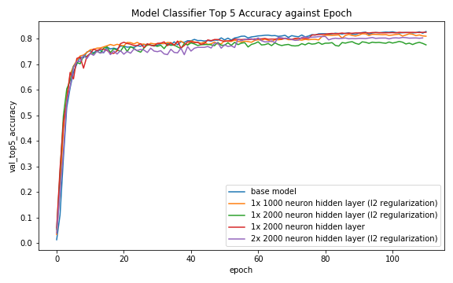

## Conclusion

The models are then tested with the test dataset and the results are as shown above. We can observe that the base model (Model 1) manages to achieve a significantly low test loss compared to other models. This means that the original model is able to generalize well enough. Adding additional layers, even with the help of dropout and L2 regularization, leads to overfitting which does not help improving the model.

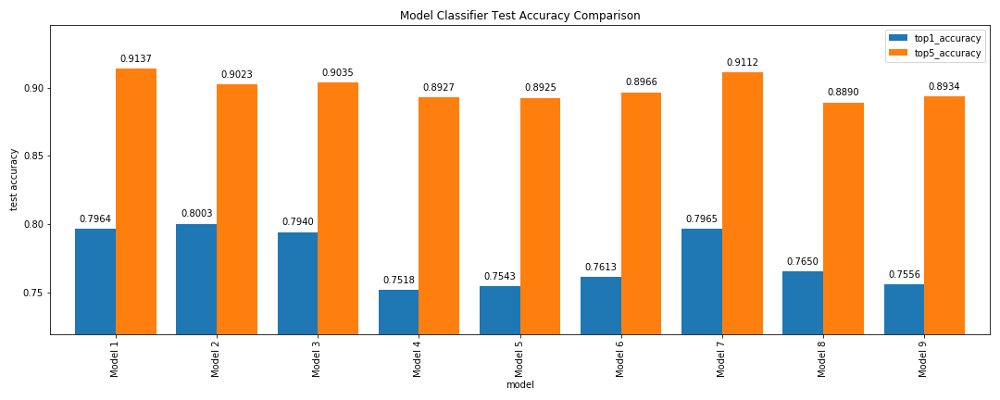
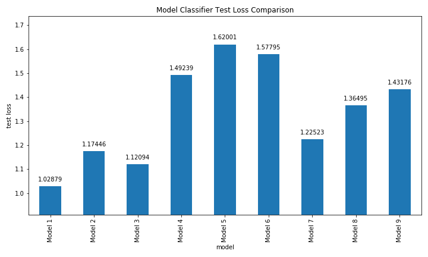

Therefore, we can conclude that the best model for car model classification is Model 1.
