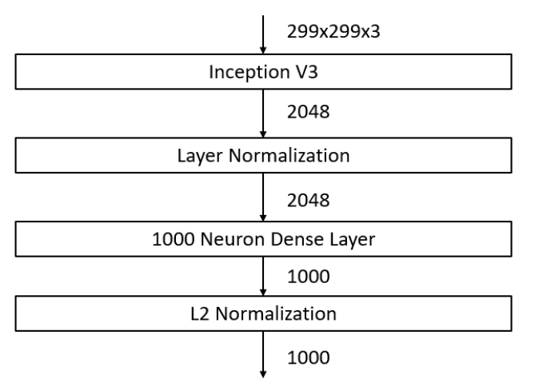
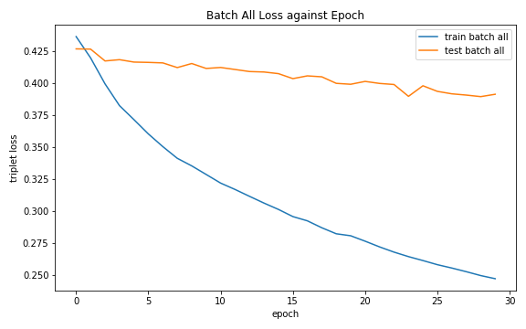
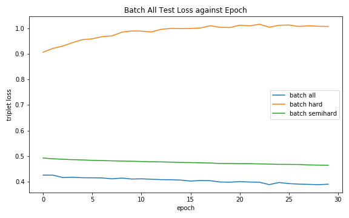
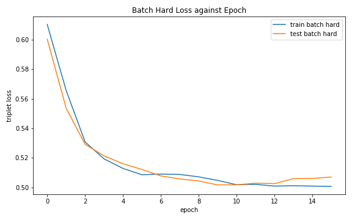
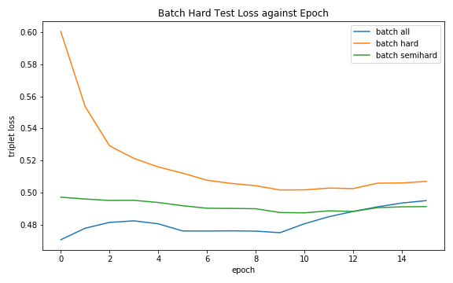
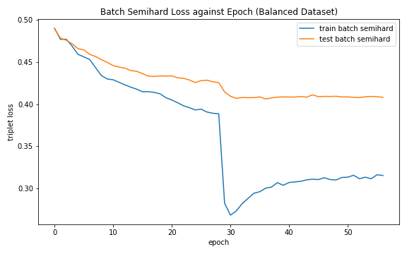
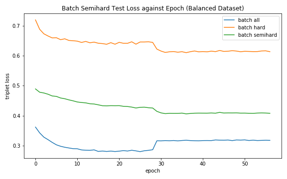
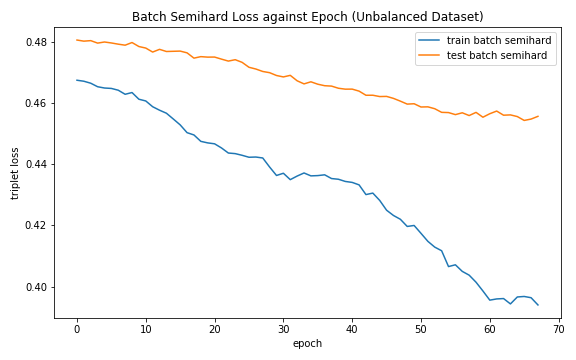
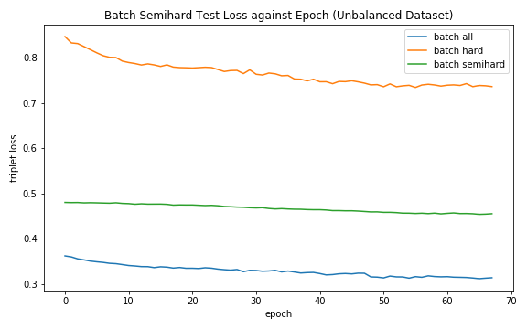

# Car Verification

Instead of classify the images according to their car makers, we can train a feature extraction model to extract embeddings for a particular image such that embeddings from images from similar car makers should be as close as possible and images from different car makers should be as far as possible. To verify if two images have the same car maker or not, a simple way is to test if the distance between embeddings are close enough.

## Dot Product Binary Cross Entropy Losses

## Triplet Loss

In this section, we use triplet loss to train a model for feature extraction. The model takes in the image as input and output an embedding with a size of 1000 for that image. The embedding represents the features extracted from the image. The embeddings will be L2 normalized so that all embeddings are projected onto the surface of a hypersphere at R1000 with a radius of 1 unit. This is to minimize the distance between embeddings and speed up the training. The architecture of the model is shown below:

The goal of triplet loss is to train the embedding such that cars with the same car maker will be projected as close as possible in the embedding space, whereas cars with different car maker will be projected as far as possible in the embedding space. The value of margin () use for training is 0.5.

Let the distance between baseline and positive to be  and the distance between baseline and negative to be . There are three kinds of triplets, which are easy triplets, hard triplets and semihard triplets. When calculating triplet loss, we replace all negative losses (easy triplets) with 0 so as to let the training focus more on the semihard triplets and hard triplets.

- **Easy triplets**: 
- **Hard triplets**: 
- **Semihard triplets**: 

Here, we use online triplet mining whereby we compute useful triplets for each batch of inputs instead of producing the triplets before the training. In order to increase the possibility for each make class to have a valid triplet, we use a resampled dataset to yield batches of images with equal amount of images for each class. There are three kinds of online triplet mining strategies, which are batch all, batch hard and batch semihard.

- **Batch all**: In the batch of images, find all possible triplets and take the mean of their triplet losses.
- **Batch hard**: In the batch of images, make each image the baseline and find the triplet that yields the maximum triplet loss (hardest triplet) corresponding to the baseline, then take the mean of the maximum triplet loss across all baseline.
- **Batch semihard**: In the batch of images, make each image the baseline and find the semihard triplet that yields the maximum triplet loss corresponding to the baseline. If there is no semihard triplet for any baseline, then the hardest triplet loss is use.
When training, we use one type of the strategy as the loss function and the other as the metric to compare which online triplet mining strategy is the best among all.

### Batch All Strategy

Firstly, we use the batch all strategy as the loss function and use the batch hard and batch semihard strategy as the metrics. We can observe that the batch all triplet loss for training decreases drastically but the batch all triplet loss for testing decreases slightly only.

We can also observe that the testing metrics, batch semihard triplet loss decreases slightly whereas the batch hard triplet loss is increasing. The model shows an overfitting trend as the training loss decreases at a higher rate compared to the testing loss. Besides, the model does not train itself to minimize the triplet loss for outliers (hard triplets) but keep training itself to minimize the loss for easier triplets, this leads to overfitting on easier triplets and increasing loss for harder triplets. Therefore, the testing loss decreases at a slower rate.

|  |  |
|-|-|

### Batch Hard Strategy

Next, we use the batch hard strategy as the loss function and use the batch all and batch semihard strategy as the metrics. We can observe that the batch hard triplet loss for training and testing decreases at similar rate, but stopped decreasing as they reaches the margin.

We can also observe that the testing metrics, batch all and batch semihard triplet loss tends to converge themselves to the margin. This indicates that the model tends to map all embeddings towards the same point. As a result, for every image, the embeddings would be similar and thus failed to extract features for different images.

|  |  |
|-|-|

### Batch Semihard Strategy

Lastly, we use the batch semihard strategy as the loss function and use the batch all and batch hard strategy as the metrics. We can observe that the batch semihard triplet loss for training experienced a drastic drop around epoch 28. This may be due to a sudden gradient exploding, which leads to many semihard triplets managing to cross the easy-semihard boundary, thus, a drastic drop in triplet loss for semihard triplets. However, we can see that the training loss eventually starts to increase, this may be due to hard triplets gradually crossing the semihard-hard boundary, causing the mean loss to increase as more semihard triplets with higher loss start to occur. In overall, we can see a decreasing trend for testing semihard triplet loss and eventually converge.

|  |  |
|-|-|

### Comparison and Testing

Across all strategies, we can conclude that the batch semihard strategy is the best of all. The summary of the final testing loss and metrics for each strategy is shown in the table below:

| Strategy       | Triplet Loss (All) | Triplet Loss (Hard) | Triplet Loss (Semihard) |
|----------------|--------------------|---------------------|-------------------------|
| Batch All      | 0.391235           | 1.006762            | 0.465088                |
| Batch Hard     | 0.480766           | 0.501837            | 0.487558                |
| Batch Semihard | 0.318177           | 0.610343            | 0.406142                |

The problem with resampled dataset to yield balanced batches is that some images from classes with large number of images may not be used. Therefore, the model is then further trained using the original dataset.

|  |  |
|-|-|

Finally, the resulting model is used for car verification purpose. During testing, we choose 8 images from 5 classes, then from each class, we choose 1 random image as the query image and find out the top 7 images with the closest embedding to the query image. The result is shown below where each row indicates query image and top-7 retrievals for this query image. <

|These 5 classes are the classes with the least number images.|
|-|
||

|These 5 classes are the classes with the most number images.|
|-|
||

|These 5 classes are random classes.|
|-|
||

We can see that in overall, the model manages to extract good embeddings as the top retrievals includes images from different view points.

